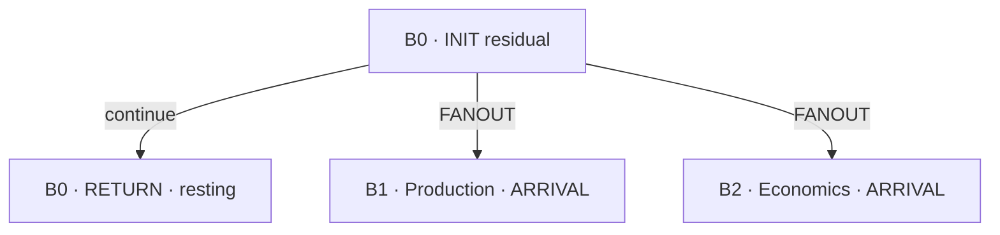

# Garden traversal: saved movement with supplied content

Jared's September 28 request to inspect Digest Aiden's integration and begin building authorizes this first implementation slice. Digest's PR #24 is preserved, including the Saṃskāra Morphology registry, bounded Governor context and Customs Authority design. This runtime implements the roadmap's first priority: **traversal state, deterministic routing and clone lineage**.

`scripts/garden_runtime.py` advances one supplied node at a time. Each accepted command saves a complete checkpoint with its original input, actual actor, configuration snapshot, decision, revision and state hash. A fresh process can continue from that file. No daemon is started. The existing Week One workers are not yet routed through this engine.

## What works

| Operation | Result |
| --- | --- |
| `start` | Creates one INIT or registered domain branch for an existing Question and its current epoch. |
| `step` | Validates the supplied output for the current node and advances exactly once. |
| `rest` / `resume` | Pauses and resumes participant-paused work at the same node. |
| `MOVE` | Relocates the current branch; its earlier visit remains in the record. |
| `CLONE` | Keeps the parent and creates one child with inherited context. |
| `FANOUT` | Keeps the parent and creates two or three children with distinct functions and target trees, within the run budget. |
| `RETURN` / `arrive` | Links a changed payload and new arrival ID back into the same tree, or records why unchanged/seen material rests. |
| `replay` | Rebuilds all transitions from the saved configuration and commands, then checks the entire saved document. |
| `project` | Rebuilds a GitHub-readable branch CSV and per-run digestion material references. |

Every registered domain currently uses the same ten-node template. INIT, Economics, Production, Diplomacy, Language, Customs and Homelessness are **supplied-content skeletons**. Registering a tree does not create an active Bee or implement its specialist analysis. The original all-at-once grammar and Chair tools in [GARDEN.md](GARDEN.md) remain available.

## Walk through the Q18 example

The [scenario](../examples/garden-traversal/q18-scenario.json) reuses the September 25 vessel pass. It records twelve supplied node outputs and three branches, including a pause/resume and FANOUT. The parent's operating-performance question remains unanswered; the two children stop at ARRIVAL awaiting supplied work. No source was fetched and no model was called by this demonstration.



Open the [branch spreadsheet](../examples/garden-traversal/worked/digestion/threshold/garden/branches.csv), [complete traversal record](../examples/garden-traversal/worked/operations/garden/runs/Q18-SUPPLIED-TRAVERSAL-20260928.json), or [digestion material packet](../examples/garden-traversal/worked/digestion/threshold/garden/Q18-SUPPLIED-TRAVERSAL-20260928.json). The CSV is a projection; exact outputs and route reasons are in the JSON record. Step and branch counts in each CSV row are totals for the run, not per-branch totals.

Rebuild the example with Python's standard library:

```bash
python scripts/garden_example.py --output examples/garden-traversal/worked
git diff -- examples/garden-traversal/worked
```

The scenario uses a fixed illustrative timestamp and an explicit Question snapshot for reproducibility. It does not register itself as live work or claim the timestamp as a real execution time. CI checks the committed output against this reconstruction.

## Rules and information lineage

`config/garden-traversal.json` defines eligible routes. Once a supplied RESID exists, an actor may request a route at a subsequent node boundary. DOMAIN-BRANCH requires true `consequential` and `distinct_functions` predicates and an attributed review reference. LANGUAGE-EXCEPTION requires true `consequential` and `language_exception` predicates. False and unknown results are recorded separately; neither creates a branch. The actor selects eligible targets; this version does not infer predicates or choose a specialist from prose.

Review fields record an actual participant's declaration, not independent authentication or proof that the research is correct. Proposed morphology powers cannot add routes. `PECULIARITY_SENSE` and `CURIOSITY` remain proposed, and the Governor remains inactive.

Each child retains its parent branch/visit/node, Question/epoch, original and parent arrival, parent output hash, exact source references, residual, routing reason and authority. Source lineage IDs name the underlying material: changing a URL or model name does not make that material independent. Sibling branches inherit the same information path and do not corroborate each other merely by existing.

MIRROR requires explicit information lineage: parent-answer visibility, source references, parent-output references, criteria references, API-record references and whether the test was inherited or separately specified. These are supplied observations, not introspection into hidden model reasoning. CROSS distinguishes inherited attachments, independently sourced attachments and epistemic bridge tests. New independent attachments require a public-source kind, a stated independence basis and a lineage distinct from inherited material. Model outputs cannot be classified as independent empirical evidence. The validator catches declared lineage conflicts; it cannot discover two secretly identical sources or verify the truth of a supplied independence claim.

Every ARRIVAL requires a language glance: known publication languages or an explicit unknown, issuing office, original/translation/summary status and source references. This version records supplied metadata; it does not detect languages or perform a multilingual comparison. An unknown glance cannot assert a language. Ordinary variation does not trigger depth on its own.

## Checkpoints, limits and continuation

Operational run files live under `operations/garden/runs/<run-id>.json`. Each file holds an append-only logical event history and a replaceable current-state projection in one atomic write. Writers share the repository lock. Commands carry a stable `event_id` and `expected_revision`; retrying the identical event is harmless, while changing its contents or writing against a stale revision is rejected. Replay checks consistency and accidental modification, not cryptographic authorship.

The default shared run budget is 80 node steps, 8 total branches, 128 events, 3 children in one FANOUT and **zero model calls**. A start packet can lower these limits. Creating children never creates more budget. Repeating a route to an already-carried target, including by changing CLONE to FANOUT, rests instead of multiplying work. A multi-target route is accepted in full or creates no children. Budget and loop rests cannot be disguised as a participant pause and resumed. A materially changed arrival can reopen completed or loop-resting work within the remaining budget. A hash only detects changed bytes; the participant remains responsible for meaningful novelty.

Completion at RETURN is durable rest, not a promise of another run. Exhausted runs and changed Question epochs require a new explicitly linked start packet; the engine neither grants new authority nor schedules that work. Preserve prior run/arrival references in the new arrival's `from` and payload. No command writes the canonical research state or admits an answer.

For operational use, load state before working, create separate JSON files for the start object and each command (see the scenario's `start` and `commands`), then run:

```bash
python scripts/week_one_state.py load
python scripts/garden_runtime.py start --file /path/to/start.json
python scripts/garden_runtime.py submit --run RUN-ID --file /path/to/command.json
python scripts/garden_runtime.py inspect --run RUN-ID
python scripts/garden_runtime.py replay --run RUN-ID
python scripts/garden_runtime.py project
python scripts/week_one_state.py save
```

Operational persistence uses the existing fast-forward-only `week-one-state` path. Older state branches may lack the new optional Garden folders; loading and saving still work. Each accepted command refreshes `digestion/threshold/garden/branches.csv` and a hashed material reference for each run. A crash after saving the run but before projecting it can be repaired by retrying the same event or running `project`. The threshold's `available_for_digestion` status means the material exists; it does not claim Digest or Governor review. Publishing an operational record requires the same authenticated state-branch access as the existing Week One runtime.

## Next slice

The next useful addition is the **provider-neutral operation interface**: feed the existing recorded API exchange into a bounded MIRROR/CROSS operation, retain exact prompt/context/answer lineage, and return supplied output through these contracts. Provider selection and authorization stay separate from tree identity. Then implement residual evaluation, domain-specific templates, provisional memory with reuse traces, and integration into workers. Autonomous specialist execution, automatic evidence verification, seasonal memory and Governor arbitration are not implemented by this slice.
