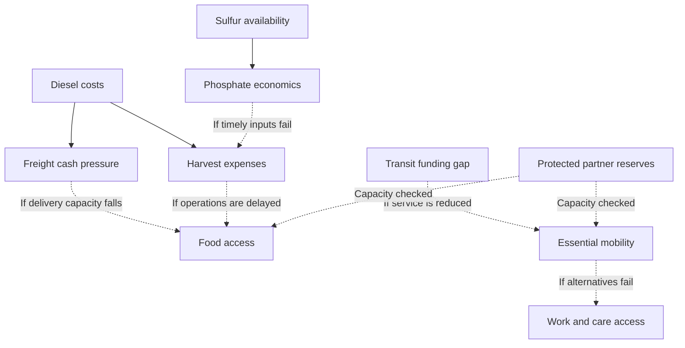

# Conditional dependency overview

Dashed arrows are proposed propagation paths. They do not mean the downstream harm has occurred. Source-linked thresholds and falsifiers are in CASCADE_GRAPH.md.

Food stocks, existing operating service and diverse production are buffers. Borrowing, shared bus capacity and volunteer effort are finite. Any rescue proposal needs a donor minimum and a route to replenishment.
