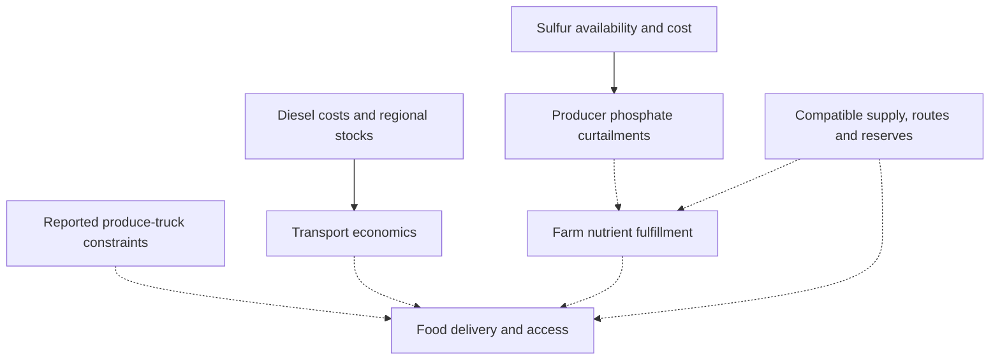
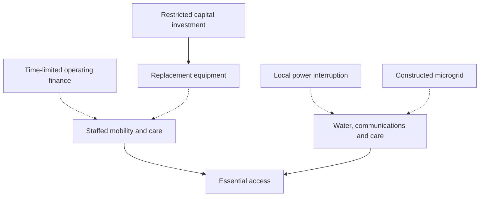

# Dependency overview — RC-002

Solid arrows below indicate a documented input/cost relationship or producer action. Dotted arrows are conditional downstream branches; co-occurrence alone does not activate them.

The graph is conditional, not a collapse forecast. Grain rail/barge operations and nutrient-specific production provide counterevidence and potential adaptation. Confirm delivered fulfillment and compatible spare capacity before asserting either failure or rescue.

Capital, cash, staffing and operational reserve are separate. Construction does not establish tested outage duration. Outside help needs a specific compatible function, route, donor floor and replenishment path. Canonical edge records retain sources, thresholds, substitutes, uncertainty, confirming observations and falsifiers.
