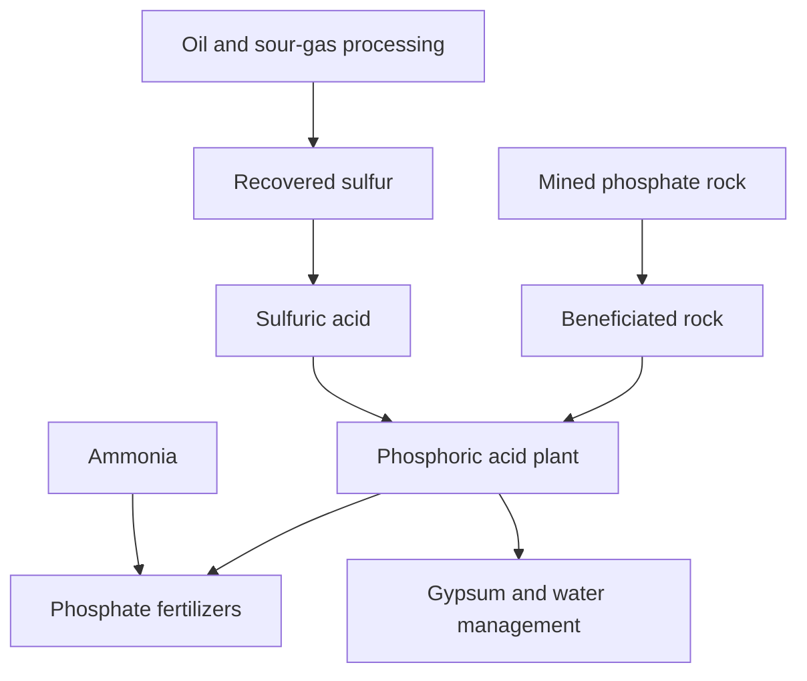

# Networks, nutrients and useful replacement

RC-003. Evidence cutoff: 21 September 2026. This is a bounded research synthesis, with current observations, historical context and proposed designs distinguished. Companion reports cover [food and replacement](FOOD_AND_CONDITIONAL_REPLACEMENT.md), [maritime security](MARITIME_NETWORK.md) and [durable commons](DURABLE_COMMONS.md).

## Sulfur, phosphorus and industrial capacity

Both sulfur and phosphate matter, in different places. Phosphate rock supplies phosphorus, the nutrient. Sulfur commonly supplies the sulfuric acid needed to extract that phosphorus economically. Neither extra sulfur nor extra potassium supplies missing phosphorus.

Industrial production begins with mined phosphate-bearing rock. Crushing, washing, screening and, depending on the deposit, flotation concentrate the useful mineral. This preparation is called beneficiation. The fertilizer route commonly reacts prepared rock with sulfuric acid, separates a gypsum by-product by filtration, and concentrates the resulting phosphoric acid. Adding ammonia produces monoammonium or diammonium phosphate, MAP or DAP. These provide nitrogen as well as phosphorus. Water management, filtration, process heat, electricity, waste handling and transport constrain actual production even where geological reserves are large. [EPA rock processing](https://www.epa.gov/sites/default/files/2020-10/documents/c11s21.pdf), [EPA acid process](https://www.epa.gov/sites/default/files/2020-09/documents/8.9_phosphoric_acid.pdf), [University of Minnesota fertilizer explanation](https://extension.umn.edu/agriculture/crop-production/nutrient-management-for-minnesota-crops/understanding-phosphorus-fertilizers).

This is a process map, not a prediction that every upstream interruption reaches farms. Existing stocks, replacement supply, application timing, plant compatibility and purchasing power determine whether a link activates.

Mosaic's August 27 operating disclosure documents phosphate idles/curtailments and attributes them to sulfur availability and affordability. That is stronger evidence of an upstream capacity constraint than a price rise alone. It remains an August disclosure; this cycle did not establish September restarts, distributor cover or missed farmer applications. [Mosaic operating account](https://mosaicco.com/Article/Fertilizer-Markets-Facts-and-Context).

The opportunity is to reduce wasteful nutrient use where soil tests justify it, recover suitable nutrients, regenerate usable acid and diversify compatible sources. Directly applying ground rock is not a universal immediate replacement: phosphorus availability depends on product and soil. Recovered material needs nutrient, contaminant, transport and application checks. These are ways to preserve fertility, not permission to cut necessary inputs on already deficient soils. [University research guidance](https://extension.umn.edu/agriculture/crop-production/nutrient-management-for-minnesota-crops/understanding-phosphorus-fertilizers).

## Venezuela: a potential feedstock path with several conversion gates

The recollection about sulfur is sound: EIA describes Venezuelan oil as heavy and sour. Heavy crude can need diluent and specialized processing. Its sulfur is not automatically a stock of saleable elemental sulfur. Refinery/gas treatment can produce hydrogen sulfide, which a functioning recovery plant converts into sulfur through the Claus process. Thus the required chain includes compatible crude processing, recovery equipment, maintenance, handling, shipping and a buyer. Recovery may occur in the receiving refinery rather than in Venezuela. [EIA structural account, 2023](https://www.eia.gov/todayinenergy/detail.php?id=60762), [EPA recovery process](https://www.epa.gov/sites/default/files/2020-09/documents/8.13_sulfur_recovery.pdf).

The legal position cannot be summarized as either unrestricted trade or a blanket prohibition. OFAC's GL52C, effective September 14, 2026, authorizes specified transactions by qualifying established U.S. entities and retains contract, payment, counterparty, vessel and other conditions. This establishes a conditional lawful pathway; it is not approval of a particular oil or sulfur transaction. [Current license text](https://ofac.treasury.gov/media/936926/download?inline=).

No current Venezuelan incremental sulfur-recovery output, merchant inventory or deliverable export surplus was verified. It belongs in the conversion-opportunity queue. ADNOC's Shah sour-gas operation provides a clearer example of established industrial recovery, but its advertised capacity also does not establish spare shipments. Existing buyers, domestic obligations and routes still matter. [ADNOC operator profile](https://www.adnoc.ae/en/adnoc-sour-gas).

## California as a node in complementary networks

The useful unit is an exchange with a preserved minimum at each end: what can be offered, what is needed in return, how it arrives, and what happens if both partners are stressed. The following is a proposed network architecture. It does not reserve anyone's resources.

| Layer | Useful exchange | Conditions that must be satisfied |
| --- | --- | --- |
| Neighborhood and city | Space, information, repair, meals, accessible transport and local knowledge | Durable access, paid coordination, working utilities, replenishment and fair allocation |
| California regions | Complementary food production, public institutions, skills and logistics | Seasonal/crop compatibility, labor, irrigation, roads and donor commitments; production is not free surplus |
| Western North America | Physically connected electricity exchange; continental food, fuel and nutrient trade | Hour-specific power and transmission; actual stocks, contracts, rail/truck access and border/legal requirements |
| Global material partners | Sulfur, fertilizer, minerals, machinery, electronics, medicine and specialist skills | Correct industrial grade, conversion capacity, lawful payment, route security, insurance and delivery time |
| Institutional partners | Financing, shared standards, technical knowledge, mediation and organized recovery | Credible commitments, local consent, accountable governance and operating support, not only capital announcements |

Western electricity exchange is already a real mechanism, with participants across several jurisdictions. It moves available power through a connected system; it does not promise imports through a simultaneous regional heat event or a constrained line. European or Asian generation is not direct California electricity reserve. Overseas partners can contribute equipment, materials and expertise on different timescales. [Western Energy Imbalance Market](https://www.westernenergymarkets.com/western-energy-imbalance-market-weim).

Geopolitical power enters through processing control, export permissions, finance and shipping access. In its July 2026 report, the IEA connects disrupted sulfur trade and acid export curbs with both fertilizer and mineral processing. Its earlier report identifies concentrated purified-phosphoric-acid supply for LFP batteries. That exposes a second dependency during electrification; it does not establish that batteries caused current fertilizer curtailments. A mine outside a dominant supplier is not a complete alternative if processing, equipment or skilled operation remains dependent on that supplier. [IEA 2026 assessment](https://www.iea.org/reports/global-critical-minerals-outlook-2026/executive-summary), [IEA 2025 battery-input context](https://www.iea.org/reports/global-critical-minerals-outlook-2025/executive-summary).

The planning response is reciprocal development: fair long-term purchasing, useful local processing, equipment repair, skills and water/energy infrastructure where production occurs. Benefits and reserves must remain with producing communities too. Alliance labels such as NATO or Commonwealth membership do not establish a specific rescue offer, and a Caribbean recovery network should not be booked as a California donor without an identified offer and route. Country-by-country current nutrient export surpluses were not established this cycle.

## Shipping safety and enforcement

Piracy is a real but uneven threat. IMB's reported global total improved in the first half of 2026, while Somali hijackings remained consequential. ReCAAP separately reports reduced Asian armed robbery and credits vessel precautions and littoral enforcement. These reporting universes overlap and differ; adding the totals or converting them to a voyage probability without exposure data would mislead. [IMB H1 report release](https://icc-ccs.org/lowest-first-quarter-maritime-piracy-and-armed-robbery-figures-since-1991-but-vigilance-remains-essential-2/), [ReCAAP H1 release](https://www.recaap.org/resources/ck/files/news/2026/Press%20release%20-%20ReCAAP%20ISC%20Half%20Year%20Report%20(Jan%20-%20Jun%202026)%20-%20final.pdf).

Off Somalia/Gulf of Aden, international naval forces can defeat particular attacks, as the September GLAMOR response demonstrates. Continued attacks and earlier captive ships show that prevention is incomplete. Naval technological superiority is different from being close enough, legally able and ready at the moment needed. Red Sea missile/drone conflict and Hormuz conflict risk require separate treatment from piracy. No September-wide route clearance or complete enforcement-to-threat ratio was verified. [EUNAVFOR September response](https://eunavfor.eu/news/resolution-piracy-incident-gulf-aden), [IMB regional warnings](https://icc-ccs.org/piracy-and-armed-robbery-prone-areas-and-warnings/).

Changing route can reduce one exposure while increasing voyage time, fuel use, vessel demand and stock needs. A Cape diversion does not recover cargo unable to leave a Gulf origin. For California, route analysis must follow the actual supplier and cargo, not a dramatic global map alone. The [maritime report](MARITIME_NETWORK.md) preserves regional detail and gaps.

## Bayer/Monsanto: a watch with distinct evidence lanes

The analogy of useful abundance being inaccessible is a serious systems question. We will look for observable barriers: pricing, licensing, distributor fulfillment, restrictions on repair or substitution, plant idling and stranded assets. None is assumed merely from a company's identity or history.

Bayer's own historical account acknowledges its incorporation into I.G. Farben and forced labor. That history warrants attention to governance and accountability; it cannot establish present intent by itself. [Company historical acknowledgement](https://www.bayer.com/en/history/1925-1945).

The glyphosate watch separates hazard evidence, exposure-based assessment, ecological effects, litigation and operating consequences. IARC's 2015 assessment classified glyphosate as probably carcinogenic to humans. EPA describes a different prior assessment and an updated review expected in late 2026; the 2022 vacatur/withdrawal history remains material. This is an open evidence watch, not a new medical conclusion. [IARC assessment announcement](https://www.iarc.who.int/wp-content/uploads/2018/07/MonographVolume112-1.pdf), [EPA review status](https://www.epa.gov/ingredients-used-pesticide-products/glyphosate).

EPA also acknowledges a 2025 review-article retraction, so research integrity is an explicit watch dimension. The reasons for that retraction were not independently established in this cycle. Neither a Bayer-caused sulfur/phosphate constraint nor deliberate nutrient withholding was established. Glyphosate herbicide and phosphate fertilizer preserve different agricultural functions; replacing weed control needs an agronomic plan, while replacing phosphorus requires another phosphorus source. Current Bayer cash runway, court outcomes and input-market concentration require further verified filings before a warning is activated.

## What would earn more research

Priority goes to local food-service cover under shared shocks; a controllable East Bay commons with funded hours; commissioned food-logistics electrification; actual phosphate restart and customer fulfillment; and merchant sulfur that can reach buyers lawfully. Detailed Bayer filings and current route advisories stay in the watch queue. Resource quantities, ownership and promised assistance remain unknown until supported by evidence.
